<h1 align="center">Hi 👋, I'm Basel El Rafei</h1>

<h3 align="center">
Flutter Developer • Software Engineer • Computer Science Graduate
</h3>

Building scalable Flutter applications with Clean Architecture, BLoC, and modern software engineering principles.

---

#  About Me

I'm a **Computer Science Graduate** and **Flutter Developer** passionate about building scalable, maintainable mobile applications that provide polished user experiences.

-  Specialized in **Flutter & Dart**
-  Strong advocate of **Clean Architecture** and **BLoC**
-  Experienced with **REST APIs**, **Firebase**, and **Dependency Injection**
-  Enjoy transforming Figma designs into responsive mobile applications
-  Always striving to write clean, reusable, and production-ready code
-  Currently learning **Spring Boot**, **Linux**, and preparing to dive into **Rust**

---

# 🛠️ Tech Stack

### 📱 Mobile Development

### 💻 Languages

### ⚙️ Backend & Databases

### 🎨 Design & Tools

### 🐧 Workflow

# 📈 GitHub Statistics

  
  

               
---

# ⚡ Core Competencies

<table>
<tr>
<td>

* Flutter Development
* Clean Architecture
* BLoC Pattern
* REST APIs
* Dio Networking

</td>

<td>

* Firebase
* Dependency Injection
* Responsive UI
* Mobile UI/UX
* Git Workflow

</td>

</tr>
</table>

---

---

# 🌱 Currently Learning

-  Linux Development Environment
-  Spring Boot
-  Rust Programming Language
-  Software Design Patterns
-  Advanced Flutter Performance Optimization

---

# ☕ Beyond Coding

-  I enjoy designing clean and modern mobile interfaces.
-  I love learning new technologies and software architecture.
-  Open to collaboration on exciting Flutter projects.

---

<i>"First, solve the problem. Then, write the code."</i>

<b>— John Johnson</b>

